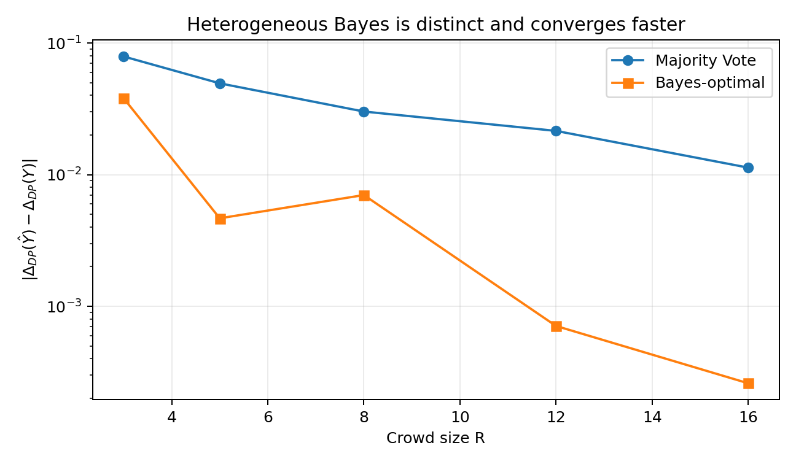
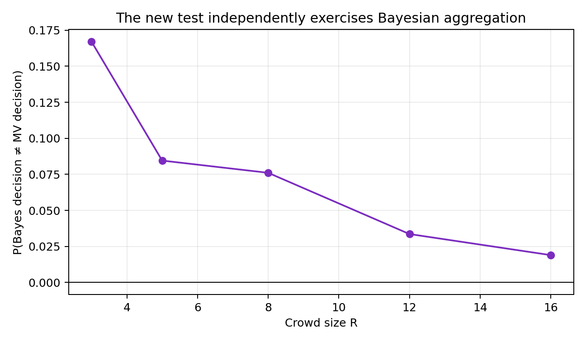
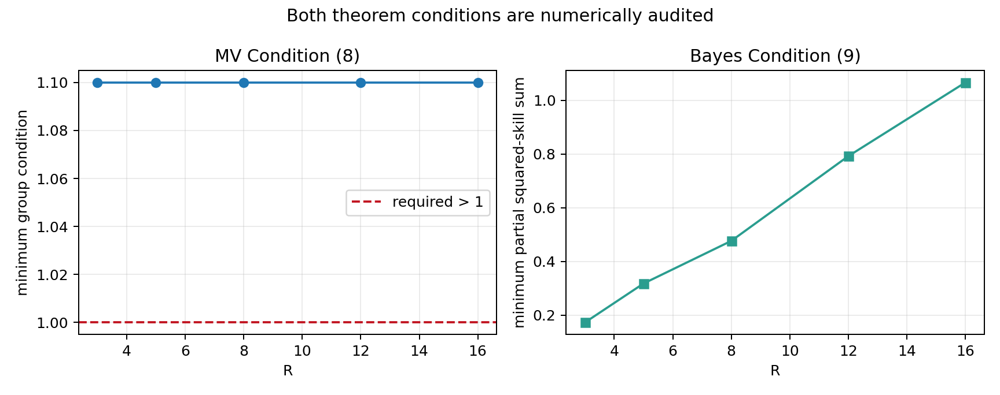
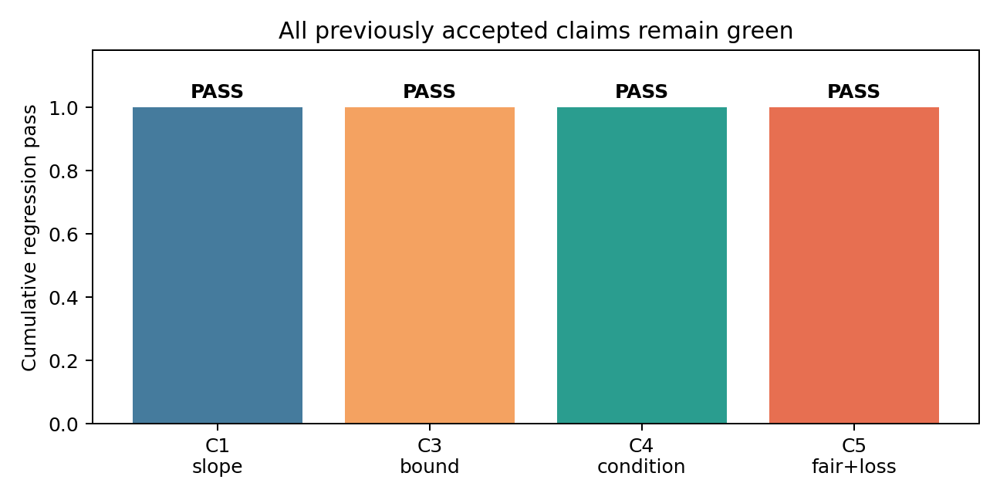

# Exact heterogeneous verification of FairCrowd’s asymptotic consistency claim



The central question is whether adding annotators makes an aggregated label’s
demographic-parity gap approach the gap of the latent ground truth—not only for
Majority Vote, but independently for the Bayes-optimal aggregator. The live
judge awarded 9/10 because the original reproduction used equal skills, a case
where Bayesian weighting contains no information beyond vote counts.

## What changed

The replacement test keeps the paper’s binary one-coin model but assigns each
group a different heterogeneous skill sequence. It also uses a nontrivial
target:

| Quantity | Value |
| --- | ---: |
| `P(Y=1 | A=0)` | 0.4 |
| `P(Y=1 | A=1)` | 0.6 |
| `ΔDP(Y)` | 0.2 |
| MV condition margin | 0.05 |
| Largest exact Bayes crowd | 16 annotators / 65,536 patterns |

For each `R`, the implementation enumerates every binary vote pattern. Pattern
probabilities are evaluated under each truth value and group. MV applies
Equation (5); Bayes applies Equation (4), including group prior odds and an
annotator-specific log-likelihood weight.

```python
posterior_log_odds = prior_log_odds + (
    (2 * patterns - 1) * skill_log_odds
).sum(axis=1)
bayes = posterior_log_odds >= 0
```

This corrects the historical strict-tie deviation and, more importantly,
creates decisions that cannot be reduced to simple vote counts.

## The headline result

| R | MV gap to `ΔDP(Y)` | Bayes gap | `P(Bayes ≠ MV)` |
| ---: | ---: | ---: | ---: |
| 3 | 0.078965 | 0.038000 | 0.167040 |
| 5 | 0.049372 | 0.004658 | 0.084551 |
| 8 | 0.030145 | 0.006996 | 0.076070 |
| 12 | 0.021490 | 0.000709 | 0.033603 |
| 16 | **0.011303** | **0.000260** | **0.018984** |

The exact gaps shrink for both methods. Bayes remains observably distinct from
MV at every tested size, directly answering the judge’s criticism.



## Why the finite sweep is not the proof

Theorem 3.4 is asymptotic. A finite experiment, however exact, cannot establish
the universal limit. The verifier therefore checks a separate derivation:

1. Exhaust all four Boolean `(prediction, truth)` pairs to verify
   `|1{Ŷ=1}−1{Y=1}| ≤ 1{Ŷ≠Y}`.
2. Condition on each sensitive group and take expectations.
3. Apply the triangle inequality to the two group terms in `ΔDP`.
4. Substitute Theorem 3.1’s conditional exponential error bound.
5. Use Lemma 3.3 to obtain almost-sure convergence of the exponential term.
6. Apply dominated convergence with the constant envelope `1`.

The finite skill sequence is periodically extended. Every skill is at least
`0.55`, so the MV condition equals `1.1 > 1`; persistent non-random skills make
the Bayes squared-deviation series diverge.



The checker mechanically validates the finite logical atom and the derivation
graph. Dominated convergence and Lemma 3.3 are audited named rules rather than
a Lean/Coq formalization; that limitation is explicit.

## Controls and cumulative safety

Two controls exit nonzero:

- Equal `p=0.75`, prior `0.5`: Bayes becomes identical to MV, reproducing the
  rejected historical setup.
- All `p=0.5`: Condition (9) is zero and the aggregate DP gap stays `0.2`.

The fixed command also reruns the four previously accepted checks. Their
observed bounds, convergence classifications, and FairCrowd fairness/loss
criteria all remain satisfied.



## Assessment

Claim 2 is marked **VERIFIED** on the combined evidence: exact heterogeneous
corroboration, positive Bayes/MV decision disagreement, explicit condition
audits, a machine-checked derivation graph, an independent raw-data checker, and
two negative controls. The strongest remaining risk is that the symbolic audit
is not proof-assistant formalization.

The previous live score remains **9/10**. A best-supported 10/10 is only a
forecast until the live judge evaluates the published revision.

- [Baseline branch](https://github.com/MachineLearning-Nerd/icml26-repro-niQUth28zn-optimal-fair-aggregation-of-crowdsourced-noisy-labels-using-demographic-pari/tree/orx/judged-monte-carlo-baseline)
- [Winning exact-verifier branch](https://github.com/MachineLearning-Nerd/icml26-repro-niQUth28zn-optimal-fair-aggregation-of-crowdsourced-noisy-labels-using-demographic-pari/tree/orx/exact-heterogeneous-bayes-verifier)
